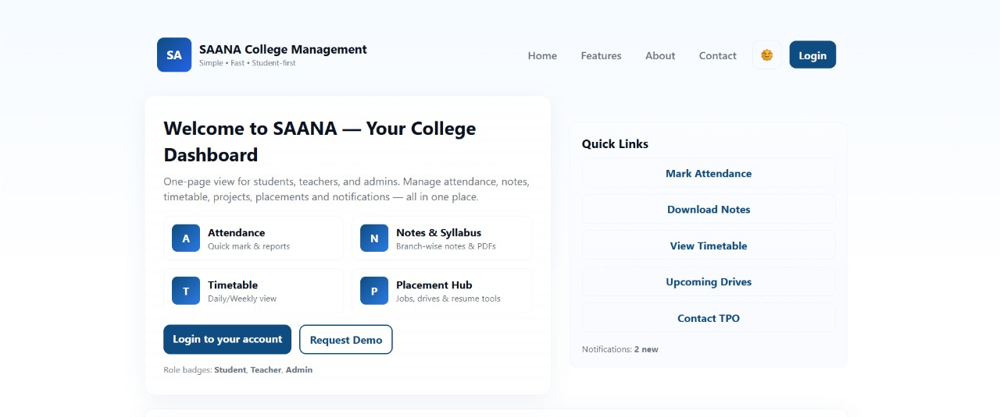
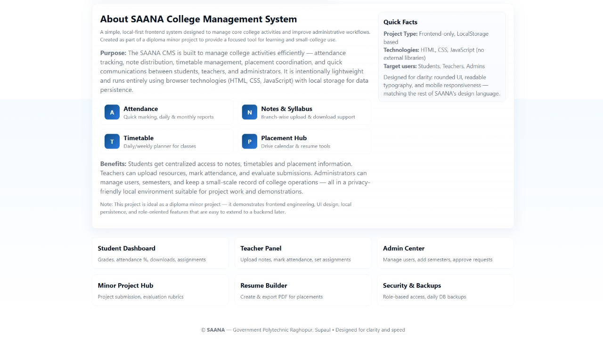
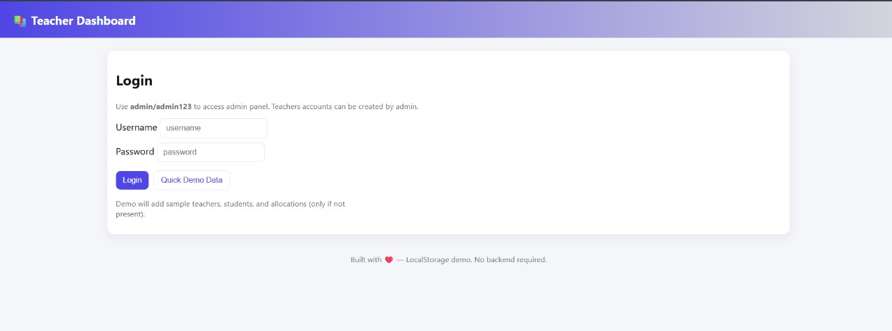
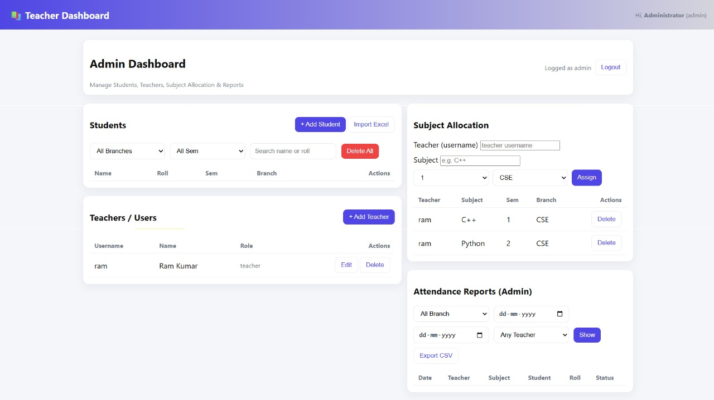

# SAANA College Management System (Under Development)

*Full Form:* SAANA — Smart AI-based Academic & Networked Administration

## Overview
SAANA College Management System is an ongoing web-based project aimed at digitalizing and automating the core operations of a college, including student, teacher, and attendance management.  
Currently, it is in its *initial phase*, developed using HTML, CSS, and JavaScript. The project will gradually evolve into a full-stack, AI-powered academic management ecosystem.

## Current Features (Phase 1 - Frontend Ready)
- *Home Page:* Responsive homepage with navigation and login access.
- *Login System:* Secure admin login restricting unauthorized access.
- *Admin Dashboard:*
  - Add, edit, delete student and teacher records.
  - Assign subjects branch- and semester-wise.
  - View attendance reports and filter teacher-wise.
- *Teacher Dashboard:*
  - Mark attendance for students.
  - Export attendance data to Excel.
- *Local Data Storage:* All data temporarily stored in browser (to be migrated to a database later).

## Future Development & AI Integration
- Backend integration: Node.js + Express + MongoDB/MySQL
- Secure JWT-based authentication system
- Role-based dashboards for Students, HOD, Principal
- AI-powered attendance analysis and performance prediction
- Smart timetable generator
- Automated report generation (Excel/PDF)
- College chatbot assistant (SAANA AI)
- Cloud deployment with live hosting and data synchronization

## Tech Stack
| Stage | Technology |
|-------|------------|
| Current | HTML, CSS, JavaScript |
| Next Phase | Node.js, Express.js, MongoDB, JWT Auth |
| Future Integration | React.js, Tailwind CSS, AI Models (Python / TensorFlow) |

## Project Status
🛠 Under Development (Continuous Progress Until Final Version)

## Team Members
- *Team Leader:* Surya Narayan Gandhi  
- *Team Members:* Anand Shekhar, Aditya Raj, Nisha Singh, Anu Kumari

- Web site:-https://surya-narayan-gandhi.github.io/SAANA-Collage-Management-System-/

## Screenshots

*Developed By:*  
*Team SAANA*  
Diploma in Computer Science & Engineering  
Government Polytechnic Raghopur, Supaul, Bihar
